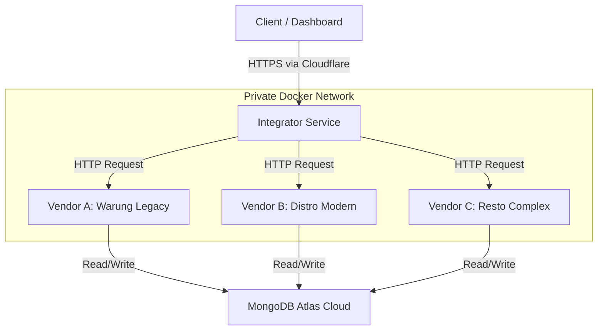

# 🚀 Banyuwangi Marketplace - Interoperability System


> **A Microservices Aggregator & Data Interoperability Simulation.**
> Final Project for Interoperability Course - Politeknik Negeri Banyuwangi.

---

## 📖 Project Overview

**Banyuwangi Marketplace** is a backend ecosystem designed to simulate a real-world **Data Integration** scenario. The system aggregates product data from three heterogeneous MSME (UMKM) vendors, each representing a different technological era and data structure standard.

The core challenge addressed is **Data Interoperability**: How to consume, map, and normalize disparate data formats (Legacy String, Modern Typed, and Complex Nested) into a single, standardized JSON output for the client (Government Dashboard).

### 🎯 Key Objectives

1.  **Microservices Architecture:** Decoupling services to ensure independence and scalability.
2.  **Data Normalization:** Converting raw, unstructured data into a standardized schema.
3.  **Aggregator Pattern:** Using a centralized Gateway (Integrator) to orchestrate data fetching.
4.  **Self-Hosted Infrastructure:** Deploying on a private Home Server using Docker and Cloudflare Tunnels.

---

## 🏗️ System Architecture

We utilize a **Monorepo Microservices** approach orchestrated by Docker Compose.  
The **Integrator** acts as an API Gateway, communicating with vendors via a private internal network.



---

## 💡 Why this Tech Stack?

- **MongoDB (NoSQL):** Chosen for schema flexibility.

  - Vendor A stores prices as **Strings** ("15000")
  - Vendor B uses **Integers** (75000)  
    MongoDB handles these distinct types natively without SQL rigidity.

- **Docker:** Ensures consistent environments across development and production, isolating each service in its own container.

- **Cloudflare Tunnel:** Exposes local services securely via Zero Trust, eliminating the need to open firewall ports.

---

## 📂 Project Structure (Monorepo)

```plaintext
banyuwangi-marketplace
├── docker-compose.yml   # Service Orchestration & Port Mapping
├── .env                 # Environment Variables (Secrets - Not tracked by Git)
├── /integrator          # [Service] API Gateway, Logic, & Normalization
├── /vendor-a            # [Service] Warung Legacy (String Data Structure)
├── /vendor-b            # [Service] Distro Modern (CamelCase & Typed Data)
└── /vendor-c            # [Service] Resto Complex (Nested Object Data)
```

### 📌 Explanation

- **docker-compose.yml** → Defines service orchestration and port mapping for all microservices.
- **.env** → Stores environment variables and secrets (excluded from Git for security).
- **/integrator** → Central API Gateway handling request normalization and vendor communication.
- **/vendor-a** → Legacy vendor service using **String-based data structure**.
- **/vendor-b** → Modern vendor service with **CamelCase naming** and **typed data**.
- **/vendor-c** → Complex vendor service managing **nested object data**.

---

## 🚀 Getting Started (Local Development)

### 🔑 Prerequisites

- Node.js v20+
- Docker & Docker Compose
- Git

---

### 1️⃣ Clone the Repository

```bash
git clone https://github.com/bugkey24/banyuwangi-marketplace.git
cd banyuwangi-marketplace
```

### 2️⃣ Configure Environment Variables

Create a `.env` file in the root directory, then copy it to all sub-directories (`vendor-a`, `vendor-b`, `vendor-c`, `integrator`).

#### 📄 `.env.example` Template

```env
# ==============================================
# BANYUWANGI MARKETPLACE - ENVIRONMENT TEMPLATE
# ==============================================
# Instructions:
# 1. Copy this file and rename it to .env
# 2. Fill in the variables with your credentials
# 3. Distribute the .env file to all service folders
# ==============================================

# --- DATABASE (MongoDB Atlas) ---
# Replace with your actual MongoDB Atlas connection string.
MONGO_URI=mongodb+srv://<username>:<password>@<cluster-address>.mongodb.net/banyuwangi_marketplace?appName=Cluster0

# --- SECURITY ---
# Shared secret key for inter-service communication.
# Must be identical across all services (Vendor A, B, C, and Integrator).
API_SECRET=replace_with_your_secret_key

# --- APPLICATION PORT ---
# Internal container port. Keep 3000 when using Docker Compose.
PORT=3000

# --- INTERNAL SERVICE URLs (Integrator only) ---
# Used by Integrator to call Vendor services within Docker network.
# No changes needed if using the provided docker-compose.yml.
VENDOR_A_URL=http://marketplace-vendor-a:3000
VENDOR_B_URL=http://marketplace-vendor-b:3000
VENDOR_C_URL=http://marketplace-vendor-c:3000
```

### 3️⃣ Run with Docker

```bash
docker compose up -d --build
```

### ⚠️ Important Notes for Docker Compose

- **1 🔗** → Network requirement  
   This project uses a custom external Docker network (`srv_homeserver-net`).  
   Make sure to create it before running `docker compose up`:

  ```bash
  docker network create srv_homeserver-net
  ```

- **2 🌐** → Port mapping

  - Integrator is exposed on 4000 → accessible publicly.
  - Vendor A, B, C are mapped to 4001–3003 → accessible for local testing.
  - 💡 In production, you may remove the ports: section for Vendor A/B/C so they are only reachable internally via the Integrator.

- **3 🔑** → Environment variables

  - All services share the same `API_SECRET` (defined in `.env`).
  - Do not commit your real `.env` file. Only `.env.example` should be tracked in Git.

- **4 📦** → Volumes
  - Each service mounts its source code folder (`./vendor-x:/app`).
  - The line `- /app/node_modules` is used to prevent host `node_modules` from overwriting container dependencies.
  - ⚠️ If you encounter issues, you can remove this line and let Docker manage `node_modules` inside the container.

---

#### 🌐 Services will be available at:

- Integrator (Public API): http://localhost:4000
- Vendor A: http://localhost:4001
- Vendor B: http://localhost:4002
- Vendor C: http://localhost:4003

---

## 🔐 API Documentation

All endpoints are protected.  
You must include the `x-api-key` header in every request.

### 🛡️ Auth Header

```http
x-api-key: drop_your_api_key_here
```

### 1️⃣ Integrator (The Main Dashboard)

This service consumes data from all vendors, normalizes it, and applies business logic (Discounts, Tax, Formatting).

- **Endpoint:** `GET /api/catalog`

#### 📄 Response Example

```json
{
  "total": 3,
  "data": [
    {
      "source": "Warung Klontong",
      "key_id": "A001",
      "name": "Kopi Kapal Api",
      "final_price": 13500, // Converted from String "15000" & Discounted 10%
      "status": "ada"
    },
    {
      "source": "Resto Kuliner",
      "key_id": "RESTO-501",
      "name": "Nasi Tempong (Recommended)", // Label added by logic
      "final_price": 22000, // Base Price + Tax calculation
      "status": "Tersedia"
    }
  ]
}
```

### 2️⃣ Vendor A (Warung - Legacy System)

Simulates an old system using **Snake_case** and **String data types**.

- **Base URL:** `/api/produk`

#### 📄 Schema

```json
{
  "kd_produk": "String",
  "nm_brg": "String",
  "hrg": "String",
  "ket_stok": "String"
}
```

#### 📌 Endpoints

- GET / → Get All
- POST / → Create
- PUT /:kd → Update
- DELETE /:kd → Delete

### 3️⃣ Vendor B (Distro - Modern System)

Simulates a modern system using **CamelCase** and proper **Data Types**.

- **Base URL:** `/api/products`

#### 📄 Schema

```json
{
  "sku": "String",
  "productName": "String",
  "price": "Number",
  "isAvailable": "Boolean"
}
```

#### 📌 Endpoints

- GET / → Get All
- POST / → Create
- PUT /:sku → Update
- DELETE /:sku → Delete

### 4️⃣ Vendor C (Resto - Enterprise System)

Simulates a complex system with **Nested Objects**.

- **Base URL:** `/api/menu`

#### 📄 Schema

```json
{
  "id": "Number",
  "details": { "name": "String", "category": "String" },
  "pricing": { "base_price": "Number", "tax": "Number" },
  "stock": "Number"
}
```

#### 📌 Endpoints

- GET / → Get All
- POST / → Create
- PUT /:id → Update
- DELETE /:id → Delete

---

## 📦 Example Requests (cURL / Postman)

### 1️⃣ Integrator - Get Catalog

```bash
curl -X GET "http://localhost:4000/api/catalog" \
  -H "x-api-key: your_secure_api_key_2025"
```

### 2️⃣ Vendor A - Create Product

```bash
curl -X POST "http://localhost:4001/api/produk" \
 -H "Content-Type: application/json" \
 -H "x-api-key: your_secure_api_key_2025" \
 -d '{
  "kd_produk": "A002",
  "nm_brg": "Teh Sosro",
  "hrg": "5000",
  "ket_stok": "ada"
}'
```

### 3️⃣ Vendor B - Update Product

```bash
curl -X PUT "http://localhost:4002/api/products/SKU-101" \
 -H "Content-Type: application/json" \
 -H "x-api-key: your_secure_api_key_2025" \
 -d '{
  "productName": "Kaos Polos Premium",
  "price": 85000,
  "isAvailable": true
}'
```

### 4️⃣ Vendor C - Create Menu Item

```bash
curl -X POST "http://localhost:4003/api/menu" \
 -H "Content-Type: application/json" \
 -H "x-api-key: your_secure_api_key_2025" \
 -d '{
  "id": 301,
  "details": { "name": "Ayam Geprek", "category": "Main Dish" },
  "pricing": { "base_price": 18000, "tax": 2000 },
  "stock": 15
}'
```

---

## 🌐 Production Deployment

This project is deployed on a **self-hosted Home Server** running **Alpine Linux**.  
Public access is managed via **Cloudflare Zero Trust (Tunnel)**.

### 📡 Services & Production URLs

| Service                 | Production URL                                   |
| ----------------------- | ------------------------------------------------ |
| **Integrator (Public)** | https://marketplace.vaultnode.web.id/api/catalog |
| **Vendor A**            | https://warung.vaultnode.web.id/api/produk       |
| **Vendor B**            | https://distro.vaultnode.web.id/api/products     |
| **Vendor C**            | https://resto.vaultnode.web.id/api/menu          |

---

## 👨‍💻 Development Team

| Role           | Student Name | Responsibility                                  |
| -------------- | ------------ | ----------------------------------------------- |
| **Vendor A**   | Munir        | Legacy API Provider (String Data)               |
| **Vendor B**   | Nadia        | Modern API Provider (Typed Data)                |
| **Vendor C**   | Hilma        | Complex API Provider (Nested Data)              |
| **Integrator** | Dida         | Lead, DevOps, API Gateway & Normalization Logic |

---

2025 © **Banyuwangi Marketplace Team**  
Built with **Node.js & Docker**
